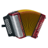

#  Accordion [](https://github.com/billthefarmer/accordion/actions) [](https://github.com/billthefarmer/accordion/releases)
[](https://f-droid.org/packages/org.billthefarmer.accordion/)

An android accordion emulator. Emulates a three row diatonic and
continental chromatic accordion. There is a choice of midi intruments
and keys, including C System and B System. The app is available on
[F-Droid](https://f-droid.org/packages/org.billthefarmer.accordion/)
and [here](https://github.com/billthefarmer/accordion/releases).


&nbsp;


  * Keys: F/Bb/Eb, G/C/F, A/D/G, C#/D/G, B/C/C#, C System, B System
  * Instruments: Standard midi set, defaults to accordion
  * Layouts: Standard 31 button and two 25 button layouts
  * Choice of fascia images

### Playing
Hold the tablet facing away from you the right way up. Play the
buttons, touching the vertical grey bar as the bellows. If you don't
know how to play button accordion, see http://info.melodeon.net. The
buttons may be reversed using the slide button at the bottom.

### External Keyboard
An external USB or Bluetooth keyboard may be used. The keys are...
```
  WERTYUIOP[
 ASDFGHJKL;'
  ZXCVBNM,./
```
The spacebar, lft and right shift keys and left and right control keys
act as the bellows. The function keys and number keys act as the bass
buttons.
